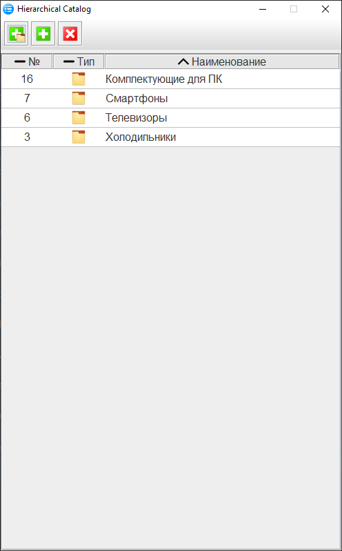
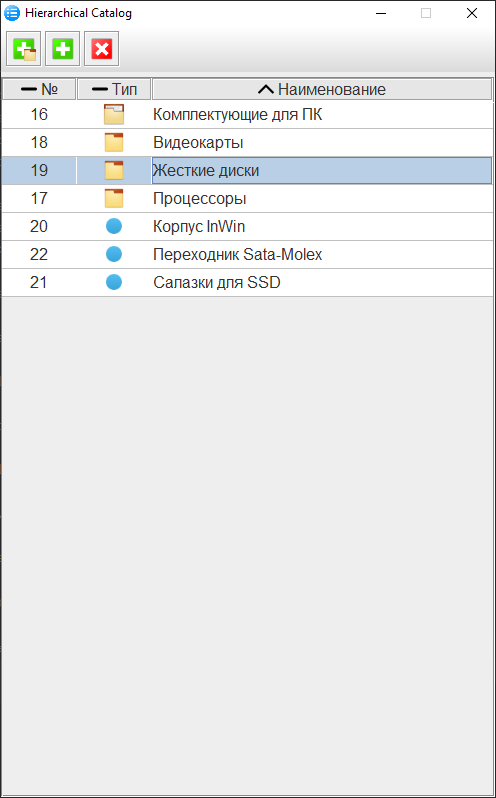
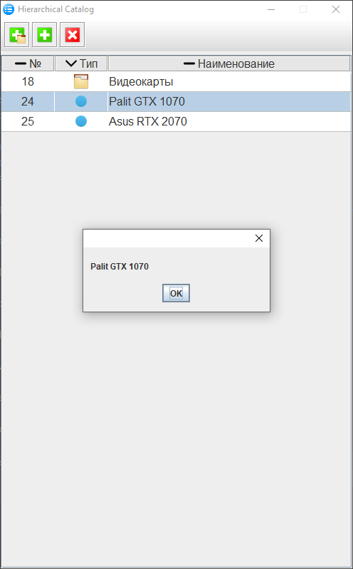

# HierarchicalCatalog

Этот небольшой проект реализует ведение справочника, имеющего иерархическую структуру. При этом элементы справочника реализованы в виде единственной таблицы базы данных. Такой справочник мог бы использоваться как элемент программы ведения учета (справочник товаров магазина, справочник товаров на складе и т.д.). 
Центральным классом приложения является класс CatalogTable, реализующий отображение и сортировку элементов справочника на экране.
Класс DBHandler выполняет низкоуровневые операции с базой данных (добавление/удаление элементов таблицы БД)
Класс ActionHandler является связующим звеном между графическим компонентом CatalogTable и DBHandler.
Класс Resources служит для загрузки графических ресурсов приложения.
Класс MainClass запускает приложение и создает объекты всех его основных классов.
Класс GUI - создает главное окно приложения и встраивает в него таблицу иерархического справочника (экземпляр CatalogTable)

Скриншоты приложения приведены ниже:

